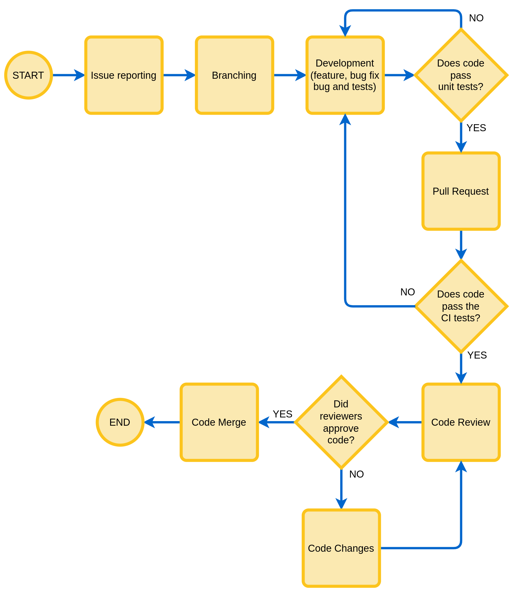

Quick start
=============

This section is for developers and contributors of AeoLiS. It describes how to get started as a developer with the intention of improving or extending the source code. 
If you are a user, please see the :ref:`user documentation <installation>` instead.

Development workflow
-----------------------

AeoLiS is developed in a collaborative way. Therefore, it is important to follow the workflow described below as closely as possibble to ensure that the code is always in a working state and that the changes are properly documented. 
Details on how to propose and push changes to the source code are documented in our `contributing guidelines <https://github.com/openearth/aeolis-python/blob/main/CONTRIBUTING.md>`_. This section provides a quick reference.

   AeoLiS collaborative development workflow.

.. _test set up:

Set up
-------

AeoLiS is developed in Python 3.10.x and tested for versions 3.9, and 3.11. It is recommended to use a virtual environment to install the dependencies.

.. code-block:: bash
    
    # Using virtualenv
    python3 -m venv venv
    source venv/bin/activate

    # Using conda
    conda create -n aeolis python=3.10
    conda activate aeolis

To install AeoLiS in editable mode, run the following command from the root directory of the repository:

.. code-block:: bash

    pip install -e .[dev]

To run the tests, run the following command from the root directory of the repository:

.. code-block:: bash

    pytest

Code Style
'''''''''''

AeoLiS strive to comply with the  `PEP8 <https://www.python.org/dev/peps/pep-0008/>`_ code style guide. We recommend `flake8 <https://flake8.pycqa.org/en/latest/>`_ to check the code style. To run flake8, use the following command from the `src/` directory of the source code:

.. code-block:: bash

    flake8 <your-module>

Docstrings
''''''''''''
 
AeoLiS uses `napoleon <https://sphinxcontrib-napoleon.readthedocs.io/en/latest/>`_ to parse the docstrings in the source code and automatically generate documentation. We recommend to follow the `Numpy style <https://numpydoc.readthedocs.io/en/latest/format.html#docstring-standard>`_ for docstrings. The use of `type hints <https://peps.python.org/pep-0484/>`_ is encouraged. For example:

.. code-block:: python

    def my_function(arg1:int, arg2:str) -> bool:
        """Summary line.

        Extended summary about the fuctionality of the function, u
        sing the Numpy style.

        Parameters:
        -----------
        arg1: int 
            Description of arg1
        arg2: str 
            Description of arg2

        Returns:
        ---------
        bool
            Description of return value

        """

        return True

To check the docstrings in a module, intall `flake8-docstrings` and run the following command from the `src/` directory:

.. code-block:: bash

    flake8 --docstring-convention numpy <your-module>
