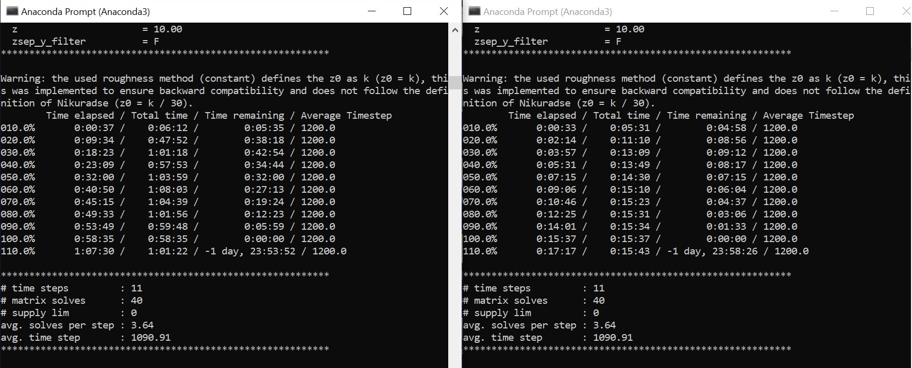

Domain decomposition and Parallel programming
=============================================

This section describes the Proof of Concept implementation for speeding up code execution in AeoLiS using domain decomposition and parallel programming techniques. 

Overview
^^^^^^^^

When domains get larger (more gridpoints), the calculation slows down. Profiling AeoLiS reveals that solving the sparse system of equations (Ax=b) accounts for approximaely 50% of the total code execution time for running a simulation. This operation involves calling the below mentioned Scipy routine that operates on the model as one single domain.   

..  code-block:: python

    Ct_i += scipy.sparse.linalg.spsolve(A, yCt_i.flatten())

We use domain decomposition to divide the model into several smaller subdomains that can be computed in parallel. 

Implementation details
^^^^^^^^^^^^^^^^^^^^^^

- Code changes for implmenting domain decomposition and parallel programming in AeoLiS are in the branch `parallel-update <https://github.com/openearth/aeolis-python/tree/parallell_update>`_ 

- Issue tracker: `Issue #115 <https://github.com/openearth/aeolis-python/issues/115>`_ 

Experiments and Results
^^^^^^^^^^^^^^^^^^^^^^^

The parallel verison of AeoLiS is benchmarked on the sandengine example. The configuration files for the example are available in the folder `examples/sandmotor/ <add-link>` in the branch `parallel-update <add-link>`. The example is run on a laptop computer with 4 cores and 8GB RAM. 

As shown in the screenshot below, the parallel version of AeoLiS is approximately **3.8X** faster than the sequential version.

Key findings
^^^^^^^^^^^^

- Speed-up achieved with the parallel version is low when the grid size is small due to the overhead involved in communication between the processes. The speed-up increases with the grid size.
- The parallel implementation fails the tests. The netCDF output is not the same when compared with the results of the sequential version.

Reflections and To do
^^^^^^^^^^^^^^^^^^^^^

- Tests for parallel version need be rethought. Existing tests may not be correct due to the overlap. Existing tests need to be investigated for applicability to the parallel version. 
- Generalization of hardocded approach to decompose matrixe is not the right approach. Domain decomposition and parallel programming is only beneficial for use cases involving large grid sizes, for example, the sandengine simulation.

Try it yourself: Running AeoLiS in parallel mode 
^^^^^^^^^^^^^^^^^^^^^^^^^^^^^^^^^^^^^^^^^^^^^^^^

You can run AeoLiS in parallel mode by following the below steps:

1. Clone the aeolis-python GitHub repository and checkout the branch `parallel-update`.
2. Download the configuration files for sandmotor example shared earlier.
3. By default, the parallel implementation is enabled in the example provided. If you want to run the parallel version for your own use case, add the keyword parallel = T in your configuration file (aeolis.txt) 
4. Enable the parallel implementation by setting the keyword `parallel` to `T` in aeolis.txt file. To do this, append a line at the end of the parameters in aeolis.txt and set 'parallel' to `T` as shown in the screenshot below. The code by default will run the sequential version of the solver.
5. You may or may not be able to run the large grids example depending on the RAM available on your computer. In that case, try running the sandmotor example with smaller grid size. This configuration is available in the folder examples/sandmotor_small_grids/ 

